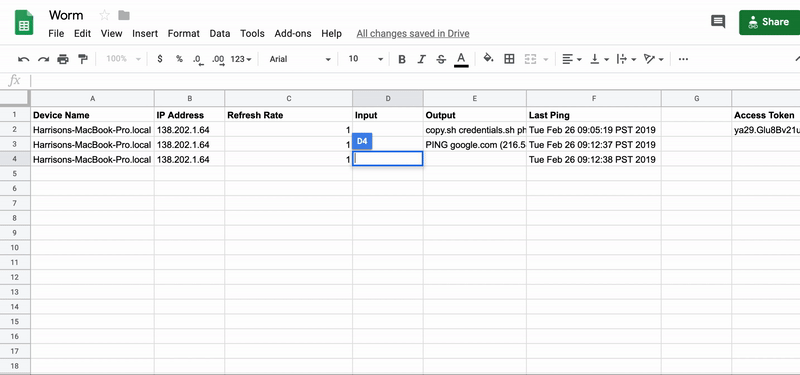

# wormy
The purpose of this bash program is to scan/infect computers on a local network
and control them from a Google Sheet in a covert manner.



## Why?
This is made to explore the dangers and speed of self-replicating or portable
software attacks in my CS 683 course Computer Security and Privacy.  Writing it
in bash was just an added fun challenge I imposed upon myself, since I'm extremely
new to it!

Additionally, I wanted to tackle the problem of finding a covert channel in
which to communicate through while still using something lower level and
relatively cross-platform that doesn't require additional tools to be installed.


## Setup

#### Configuring the Covert Channel
After cloning the repository, you'll want to duplicate this public
[Google Sheet](https://docs.google.com/spreadsheets/d/1aEhIRQKObcJggyaIar-TxUxpMT5q946bVGL30yWdz4g/edit?usp=sharing)
that acts as the homing location and control system for the infected nodes.

Next, you'll want to create both a Google Sheets API token **and** a service
account.
> **Note:** We need both, as a token is required to retrieve contents from the sheet, 
but we need an authenticated session to use any POST/PUT commands.  We'll
use this service account to generate an authenticated session that will automatically
transfer the session's `authentication token` over the sheet and be shared by the infected nodes

When a service account is created, you should be able to download a `json` file
that contains credentials for authentication purposes... It contains information
such as the `client_secret` and `project_id`.  Place this file in the `/cron`
directory.

You should be able to run
```bash
cd cron
npm install

node index.js
```
from your host device, follow the auth-flow,
and watch the spreadsheet be updated with an `authentication token`

> **Note:** If you don't see an `authentication token` placed in the sheet, then
you won't be able to communicate with the nodes later.  It's best to debug any
authentication issues here first, but is not required.


Place both the `API_KEY` and the `SPREADSHEETID` into a file called `worm/credentials.sh`
```bash
export API_KEY="<API_KEY_FROM_GOOGLE>"
export SPREADSHEETID="<ID_OF_SHEET_FROM_URL>"
```
> **Note:** This file is automatically sourced when `worm.sh` is spun up on the remote device,
but there may be better more covert ways to store these for the possibility of revoking
access, just as we can with the `authentication token`


You can test to see if your credentials are configured correctly by doing something
like
```bash
cd worm

source credentials.sh
./phone-home.sh $API_KEY $SPREADSHEETID
```
which should return the `authentication token` we generated earlier and a parameter
that specifies the row in which it will be communicating on.  If you see this, you're
good to go and can begin distributing your worm.

#### How the Covert Channel Works
In order to circumvent using a suspicous looking IP or traffic behaviors on a network
level, I decided to use Google Sheets.  The sheet provides functionality to view
the
- `Device Name`
- `Public IP Address`
- `Refresh Rate` in seconds, the time to sleep between pinging the Google Sheet
- `Input` command line input
- `Output` command line output
- `Last Ping` date in the format of the remote device's timezone

#### Running and Distribution
If you've correctly configured the communication channel, you can then specify
your range of IPs to probe by altering the `nmap` command in the scan function
of `worm.sh`

Once you are on a target network, you can begin the process by running `worm.sh`

## Caveats
This program is hard coded to only infect raspberry pi's with the default password,
to avoid uncontrolled infections.  You can surely alter this to a desired username
or password.  I plan to add dictionary attacks in the future but after adding a failsafe
to kill a worm remotely via the Google Sheet (I guess you could, by using remote bash
commands like `ps` and `kill` but this could become tedius when the worm is spreading
rapidly).
